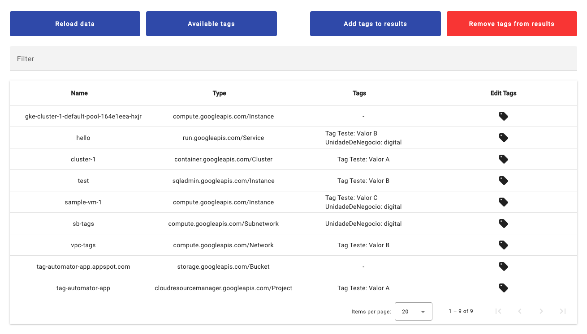
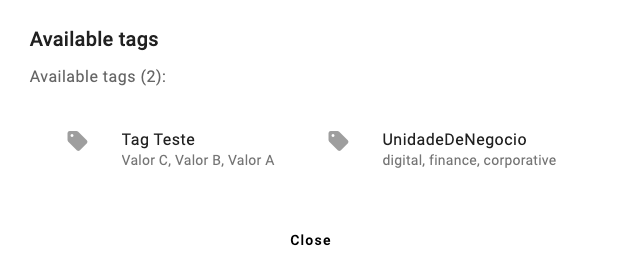
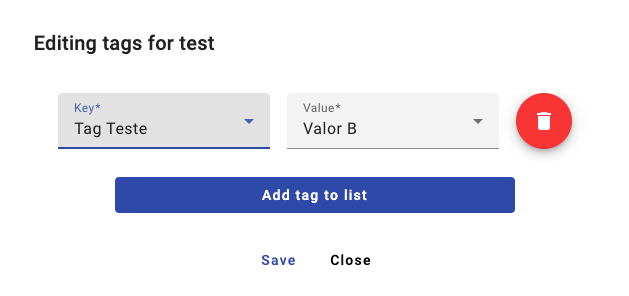

# tag-automator

Simple tool to easily visualize and manage tag bindings across organization, folder or project.

> This is **not** an official Google product.

It uses Cloud Asset Inventory ([searchAllResources](https://cloud.google.com/asset-inventory/docs/reference/rest/v1/TopLevel/searchAllResources)) to list the resources and the Resource Manager API ([tagBindings.create](https://cloud.google.com/resource-manager/reference/rest/v3/tagBindings/create)) to manage tag bindings.

## List your resources
You can visualize name, type and applicable tags for each resource - quick filter also available!



## Available tags
Visualize all available tags to use within bindings



## Bind tags
Finally, edit tags for a single resource or even to add/remove specific tags to multiple resources in bulk



## Installing 

There is a **backend** (Python) and a **frontend** (Angular) to make it work.

You have 2 options to install:

### Run a script

1. Make sure to have `gcloud` installed and authenticated before running the `install.sh` script.
2. Run `install.sh` and follow the steps.

<!-- ### Terraform -->

<!-- 1. Make sure to have `gcloud` installed and authenticated. -->
<!-- 2. Have Terraform and Git installed. -->
<!-- 3. Edit `terraform/terraform.tfvars` to your configurations. -->
<!-- 4. `terraform apply`, validate the plan and accept! -->

## Changing configurations

You can provide the following environment variables to the backend (`backend/backend.yaml`)

- `SCOPE` (**required** - the scope to pull resources from), must be one of the following:
  - `projects/{PROJECT_ID}` (e.g., "projects/foo-bar")
  - `projects/{PROJECT_NUMBER}` (e.g., "projects/12345678")
  - `folders/{FOLDER_NUMBER}` (e.g., "folders/1234567")
  - `organizations/{ORGANIZATION_NUMBER}` (e.g., "organizations/123456")

- `ASSET_TYPES` (**optional** - which assets to filter):
  - If provided, must be a list of [Asset Types](https://cloud.google.com/asset-inventory/docs/supported-asset-types).
  
  By default it uses:
  
  ```
  [
        "compute.googleapis.com/Instance",
        "storage.googleapis.com/Bucket",
        "sqladmin.googleapis.com/Instance",
        "cloudresourcemanager.googleapis.com/Folder",
        "cloudresourcemanager.googleapis.com/Organization",
        "cloudresourcemanager.googleapis.com/Project",
        "run.googleapis.com/Service",
        "container.googleapis.com/Cluster",
        "compute.googleapis.com/Network",
        "compute.googleapis.com/Subnetwork",
    ]
  ```

## Known limitations

- After successfuly editing tag bindings they are reflected imediately in the frontend, however it may take some seconds (usually 10-20s) for it to be reflected in the listing API.

- When adding new asset types to `ASSET_TYPES` configuration, the expected ID for the resource may not work right away and may need some convertion.

- You can only attach/dettach tags from resources, it's not possible to create new tag keys/values in the tool.

## Contributing

Feel free to fork, open issues and pull requests!
